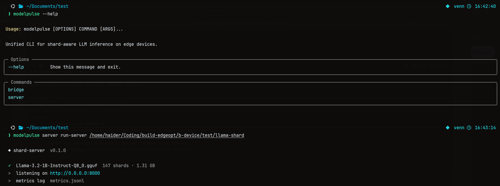
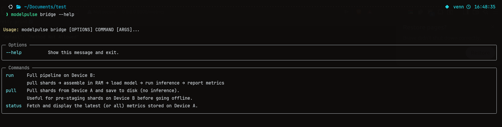
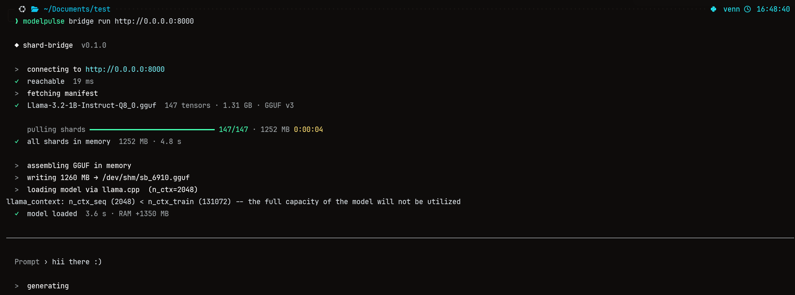
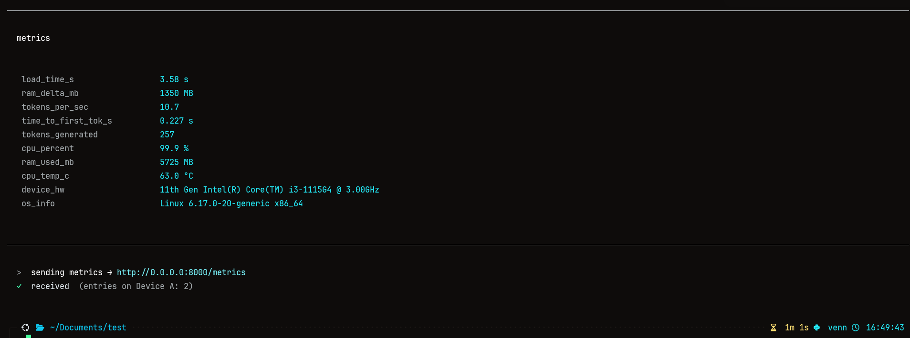

````markdown
# ModelPulse 🚀

**End-to-end partial-weight transfer pipeline.**

Device A serves model shards → Device B reconstructs the GGUF in RAM and runs inference with **no persistent GGUF reconstruction on disk**.

```ascii
Device A                                      Device B
────────────────────                          ───────────────────────────────────
modelpulse server ./shards                   modelpulse bridge run http://192.168.1.10:8000
  │                                           │
  ├── GET /manifest  ◄────────────────────  │  1. fetch manifest
  ├── GET /shards/*   ◄────────────────────  │  2. pull all shards (streaming)
  │                                         │  3. assemble GGUF in RAM → /dev/shm
  │                                         │  4. llama.cpp loads from /dev/shm
  │                                         │  5. run inference, stream tokens
  └── POST /metrics   ◄────────────────────  │  6. send collected metrics
````

---

## 📸 Screenshots

**Server (Device A)**


**Bridge (Device B)**


**Inference in Progress**


**Metrics Sent Back**


---

## 📦 Install

```bash
pip install modelpulse
```


## 🔄 Workflow

### 1 — Prepare shards on Device A

Use `gguf_to_shards.py` from the companion tools to convert your GGUF model:

```bash
python tools/gguf_to_shards.py convert model.gguf ./shards/
```

### 2 — Start the server on Device A

```bash
modelpulse server run ./shards
```

### 3 — Run inference on Device B

```bash
modelpulse bridge run http://192.168.1.10:8000
```

---

## 📋 Commands

### Device A (Server)

```bash
modelpulse server run <shards_dir> [options]
```

| Option           | Default         | Description              |
| ---------------- | --------------- | ------------------------ |
| `--port`         | `8000`          | Server port              |
| `--host`         | `0.0.0.0`       | Bind address             |
| `--metrics-log`  | `metrics.jsonl` | Metrics log file         |

### Device B (Client)

```bash
modelpulse bridge run <host> [options]
modelpulse bridge status <host> [--all]
```

| Command  | Description                          |
| -------- | ------------------------------------ |
| `run`    | Full pipeline: pull → infer → report |
| `status` | Display latest metrics from Device A |

#### Bridge `run` options

| Flag            | Default         | Description          |
| --------------- | --------------- | -------------------- |
| `--prompt / -p` | *(interactive)* | Prompt string        |
| `--max-tokens`  | `256`           | Tokens to generate   |
| `--temp / -t`   | `0.7`           | Sampling temperature |
| `--ctx`         | `2048`          | Context window       |
| `--no-report`   | `false`         | Skip sending metrics |

---

## 💾 Zero-Disk Strategy

```text
shard_data  ─── assemble_gguf_bytes() ──► gguf_bytes (RAM)
                                              │
                                       write_bytes()
                                              │
                                        /dev/shm/sb_<pid>.gguf   ← tmpfs, never touches physical disk
                                              │
                                       del gguf_bytes            ← Python bytes freed
                                              │
                                    Llama(model_path=...)        ← mmap from tmpfs
                                              │
                                       cleanup() → unlink()
```

This keeps the model file temporarly on the ram, while still satisfying llama.cpp’s file-path requirement.

The system prioritizes /dev/shm and /run/shm by checking for existence and write access, falling back to $TMPDIR or /tmp if no RAM-backed filesystem is available.
---

## 📁 Project Layout

```bash
modelpulse/
├── pyproject.toml          # Packaging config
├── README.md               # This doc
├── Images/                 # Screenshots (server.png, bridge.png, etc.)
├── modelpulse/             # Core package
│   ├── __init__.py
│   ├── main.py            # Unified CLI: modelpulse bridge, modelpulse server
│   ├── shared/            # Shared models
│   │   ├── __init__.py
│   │   └── models.py      # ShardManifest, InferenceMetrics
│   ├── device_a/          # Server side
│   │   ├── __init__.py
│   │   └── server.py      # FastAPI server
│   └── device_b/          # Client side
│       ├── __init__.py
│       ├── cli.py         # Bridge CLI
│       ├── bridge.py      # RAM GGUF assembly + llama.cpp
│       └── shard_client.py # Async HTTP client
├── tools/                 # Utilities
│   ├── gguf_parser.py
│   └── gguf_to_shards.py  # GGUF → shard converter
```

---

**Ready to shard your models across devices with RAM-only inference?**
Run the commands above and stream tokens without rebuilding GGUF on persistent storage. ✨

